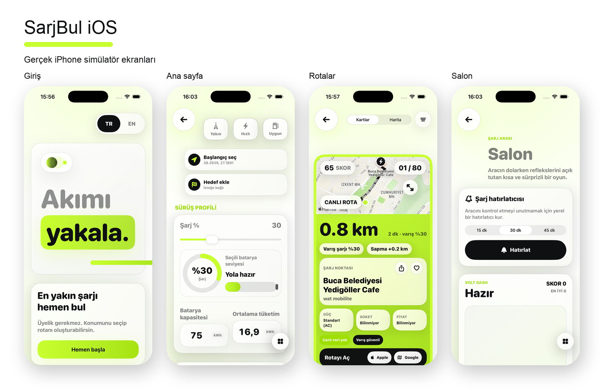

# SarjBul iOS

SarjBul, Türkiye genelindeki elektrikli araç şarj noktalarını menzil, rota, güç, fiyat ve kullanıcı durum bildirimleriyle sıralayan native SwiftUI uygulamasıdır. Web sürümündeki domain mantığı iOS'a taşınmış; arayüz, rota ve cihaz yetenekleri Apple platformlarına uygun katmanlara ayrılmıştır.

## Ekran Görüntüleri



Tasarım değiştiğinde bu görsel de aynı değişiklikle güncellenir. Renk, radius, gölge ve tipografi tokenları `SarjBul/Resources/design-tokens.json` içinde tek kaynaktır.

## Ürün Özellikleri

- Cihaz konumu, adres/POI arama ve manuel koordinat akışı
- İsteğe bağlı hedef ile rota koridorundaki istasyonları bulma
- Batarya kapasitesi, şarj yüzdesi, tüketim ve güvenlik payıyla varış şarjı hesabı
- Yakın, hızlı, ekonomik ve dengeli sıralama; soket, güç ve menzil filtreleri
- Gerçek `MKDirections` rotası, trafik katmanlı MapKit görünümü ve Apple/Google Maps aktarımı
- Dikey snap kart akışı ile bütün istasyonları gösteren harita arasında geçiş
- ETag destekli uzaktan istasyon verisi, kalite kapısı, yerel cache ve bundle fallback
- Firebase Auth token yenileme, favori senkronizasyonu, durum bildirimi ve uygulama içi hesap silme
- Firebase App Check/App Attest, Crashlytics, sıkı Realtime Database kuralları ve sunucu tarafı özetleme
- Favoriler, son açılan rotalar, paylaşılabilir `sarjbul://station/...` bağlantıları
- Şarj hatırlatıcısı ve kısa Salon oyunu
- Türkçe/İngilizce, Dynamic Type, Reduce Motion, VoiceOver etiketleri ve çevrimdışı durum

## Mimari

```text
SarjBul/App/              Uygulama durumu, konum, rota, ağ ve entegrasyon başlangıcı
SarjBul/Features/         SwiftUI özellik ekranları
SarjBul/DesignSystem/     Ortak native bileşenler ve token tüketimi
SarjBulCore/              UI'dan bağımsız model, skor, arama ve servisler
SarjBulTests/             Domain testleri
SarjBulUITests/           Kritik misafir akışı smoke testi
firebase/functions/       Güvenilir durum özeti ve hesap verisi temizleme işleri
database.rules.json       auth.uid tabanlı Realtime Database izolasyonu
```

## Kurulum

Gereksinimler: güncel Xcode, Homebrew ve XcodeGen.

```bash
brew install xcodegen
xcodegen generate
open SarjBul.xcodeproj
```

`SarjBul/Resources/AppConfig.sample.plist` dosyasını `AppConfig.plist` adıyla oluştur ve Firebase değerlerini ekle. Firebase kullanılacaksa Console'dan indirilen gerçek `GoogleService-Info.plist` dosyasını aynı klasöre koy. İki dosya da `.gitignore` kapsamındadır.

Ayrıntılı kurulum ve deploy sırası: [Docs/FIREBASE_SETUP.md](Docs/FIREBASE_SETUP.md).

## Veri

Uygulama önce geçerli cache'i, sonra bundle içindeki `stations.json` dosyasını açar. Arka planda web reposundaki güncel `stations.json` ETag ile sorgulanır. Yeni veri 1.000 kaydın veya bundle sayısının yüzde 70'inin altındaysa cache'e yazılmaz.

Arama motoru önce enlem/boylam bounding box ile 12 bin üzeri kaydı daraltır; haversine, skor, tahmin ve rozet hesaplarını yalnızca aday kümesinde çalıştırır. Hedef seçilmişse adaylar yolculuk koridoru ve sapma maliyetine göre değerlendirilir.

## Doğrulama

```bash
swift test
xcodegen generate
xcodebuild -project SarjBul.xcodeproj -scheme SarjBul -destination 'generic/platform=iOS Simulator' CODE_SIGNING_ALLOWED=NO build
cd firebase/functions && npm ci --ignore-scripts && npm run lint && npm audit --audit-level=moderate
```

GitHub Actions aynı çekirdek testleri, plist/privacy manifest doğrulamasını, bağımlılık denetimini, uygulama derlemesini ve UI smoke testini çalıştırır.

## Yayın

- [Gizlilik politikası](Docs/PRIVACY_POLICY.md)
- [Kullanım koşulları](Docs/TERMS_OF_USE.md)
- [Release kontrol listesi](Docs/RELEASE_CHECKLIST.md)
- [Harici entegrasyon sınırları](Docs/INTEGRATIONS.md)

Rezervasyon, şarj başlatma/durdurma, ödeme ve canlı soket uygunluğu sahte butonlarla taklit edilmez. Bu kontroller yalnızca operatörün yetkili API'si ve ticari izinleri bağlandığında açılmalıdır.
